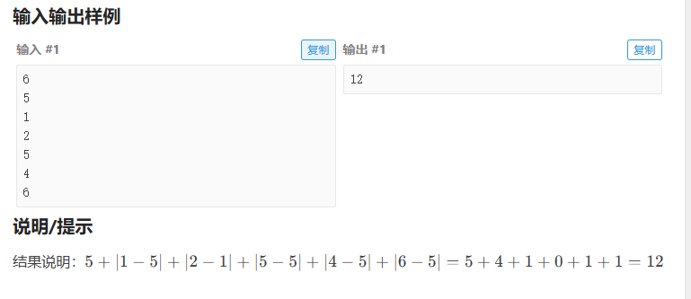

# 【算法题】最小波动值-营业额问题
## 题目链接：https://www.luogu.com.cn/problem/P2234
## 题目截图
 <!-- 本地图片用相对路径，比如./images/最小波动值题目.png -->
 <!-- 本地图片用相对路径，比如./images/最小波动值题目.png -->

## 题目核心
- 需求：计算每天营业额与之前所有天营业额的最小差值（绝对值），累加所有天的最小差值
- 考点：multiset的使用（有序容器、前驱/后继查找）、迭代器操作

## 新学知识点总结
### 1. set/multiset 核心区别
| 容器       | 有序性 | 允许重复 | 底层实现 | 时间复杂度 |
|------------|--------|----------|----------|------------|
| set        | 升序   | 否       | 红黑树   | O(log n)   |
| multiset   | 升序   | 是       | 红黑树   | O(log n)   |
| unordered_set | 无序 | 否       | 哈希表   | O(1)       |

### 2. multiset 关键方法
| 方法          | 作用                                  | 注意事项                     |
|---------------|---------------------------------------|------------------------------|
| begin()       | 指向第一个有效元素的迭代器            | 空容器begin()=end()          |
| end()         | 指向最后一个元素的下一个位置（无效）| 不可解引用，仅用于判空/遍历   |
| lower_bound(x)| 找第一个≥x的元素的迭代器              | 无则返回end()，仅有序容器支持 |
| insert(x)     | 插入元素并自动排序                    | 允许重复插入                 |

### 3. 迭代器核心操作
- 解引用：`*it` 获取迭代器指向的元素值
- 移动：`++it`（后移）、`--it`（前移），仅有序容器有效
- 判空：必须先判断`it != s.end()`/`it != s.begin()`，避免越界

## 踩坑点（重点！）
1. ❌ 重复调用`lower_bound(cur)`：每次调用生成新迭代器，浪费性能且逻辑混乱 → ✅ 只调用1次，用`auto it`保存
2. ❌ 找前驱时漏写`--it`：`it`默认指向后继，不前移永远找不到前驱 → ✅ 判空后执行`--it`
3. ❌ 解引用end()：直接崩溃 → ✅ 所有迭代器操作前先判空

## 最终AC代码
```cpp
#include <bits/stdc++.h>
#define ios ios::sync_with_stdio(false), cin.tie(0), cout.tie(0);
#define x first
#define y second
#define int long long
using namespace std;
typedef pair<int, int> PII;
const int N = 1e6 + 10;
const int M = 2e5 + 10;
const int INF = 0x3f3f3f3f;
const double INFF = 0x7f7f7f7f7f7f7f7f;
const int mod = 1e9 + 7;
int t, n, a[N];

//最小波动值  <set> --set/multiset unique/all  
//begin()：指向容器「第一个元素」的迭代器
//end(): 指向容器「最后一个元素的下一个位置」的迭代器
//lower_bound(x)：找「第一个≥x」的元素的迭代器,如果所有元素都小于 x，返回 end()
signed main()
{
	ios;
	
    cin>>n;
    for(int i=0;i<n;i++){
    	cin>>a[i];    //输入每天的营业额 
	}
	
	multiset<int> s1;
	s1.insert(a[0]);
	int total_min_diff=a[0];
	
	//处理第2天~第n天的最小波动值 
	for(int i=1;i<n;i++){
		int cur=a[i];
		int min_diff=LLONG_MAX;    //初始化最小波动值为最大值
		
		auto it = s1.lower_bound(cur);
		
		//寻找大于cur的第一个数 
		if(it!=s1.end()) {
			min_diff=min(min_diff,abs(*it - cur));
		}
		
		//寻找小于cur的第一个数
		if(it!=s1.begin()) {
			--it;
			min_diff=min(min_diff,abs(*it - cur));
		}
		
		total_min_diff+=min_diff;
		s1.insert(cur);
	}
	
	cout << total_min_diff << endl;
	 
    return 0;
}