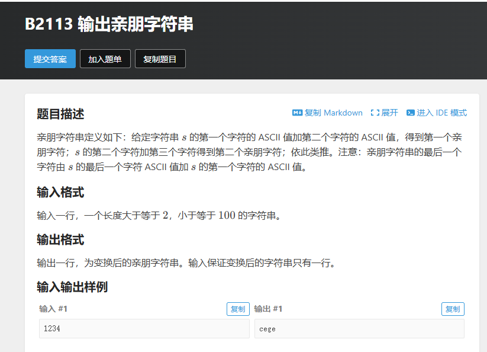

# 【算法题】亲朋字符串
## 题目链接：https://www.luogu.com.cn/problem/B2113
## 题目截图
 <!-- 本地图片用相对路径，比如./images/最小波动值题目.png -->
## 题目核心
- 需求：给定一个字符串`s1`，遍历每个字符，将当前字符与下一个字符的ASCII值相加后转换为字符（最后一个字符与第一个字符相加），将所有结果拼接成新字符串`s2`并输出
- 考点：C++ string类的核心特性、字符ASCII值运算、类型转换、字符串遍历与拼接

## 新学知识点总结
### 1. string 核心特性
| 特性       | 说明                                  | 注意事项                     |
|------------|---------------------------------------|------------------------------|
| 动态性     | 自动管理内存，支持动态扩容            | 未初始化的string长度为0，不可直接下标赋值 |
| 字符访问   | 可通过`[]`下标访问单个字符（如`s1[i]`） | 下标越界会导致未定义行为，需先判断`i < s1.size()` |
| 长度获取   | `size()`/`length()`返回字符个数       | 两者功能等价，`size()`更常用 |
| 底层存储   | 以`\0`结尾，兼容C语言字符串（`c_str()`可转const char*） | 直接修改`c_str()`返回值会崩溃 |

### 2. string 关键方法
| 方法          | 作用                                  | 适用场景                     |
|---------------|---------------------------------------|------------------------------|
| push_back(c)  | 在字符串末尾追加单个字符`c`           | 未初始化/空字符串的字符拼接  |
| append(str)   | 在末尾追加字符串`str`                 | 批量拼接多个字符/字符串      |
| += 运算符     | 追加字符/字符串（如`s2 += 'a'`）      | 代码简洁，推荐日常使用       |
| clear()       | 清空字符串，长度变为0                 | 复用字符串时清空原有内容     |
| empty()       | 判断字符串是否为空（长度为0）         | 遍历前判空，避免越界         |

### 3. 字符与ASCII值运算
- 字符本质：C++中`char`是8位整数类型，存储的是字符的ASCII值（如`'a'`对应97，`'0'`对应48）
- 运算规则：字符可直接参与整数运算（`'a' + 'b'`等价于`97 + 98`）
- 类型转换：`static_cast<char>(num)`可将整数转回字符（需确保num在char有效范围内）

### 4. 类型转换核心要点
| 转换方向       | 方法                                  | 注意事项                     |
|----------------|---------------------------------------|------------------------------|
| 整数 → 字符    | `static_cast<char>(sum)`              | 避免sum超出char的取值范围（-128~127） |
| 字符 → 整数    | `static_cast<int>(c)`                 | 可直接获取字符的ASCII值      |

## 踩坑点（重点！）
1. ❌ 未初始化的string直接下标赋值：`string s2; s2[0] = 'a'` → ✅ 空字符串需用`push_back()`追加字符
2. ❌ 忽略最后一个字符的边界处理：漏写`i==s1.size()-1`时的`s1[i]+s1[0]` → ✅ 单独判断最后一个字符的拼接逻辑
3. ❌ 类型转换遗漏：直接将`sum`赋值给char变量（如`char res = sum`） → ✅ 用`static_cast<char>`显式转换，代码更规范
4. ❌ 下标越界：`i <= s1.size()`导致访问`s1[s1.size()]` → ✅ 遍历条件为`i < s1.size()`

## 最终AC代码
```cpp
#include <bits/stdc++.h>
#define ios ios::sync_with_stdio(false), cin.tie(0), cout.tie(0);
#define x first
#define y second
#define int long long
using namespace std;
typedef pair<int, int> PII;
const int N = 1e6 + 10;
const int M = 2e5 + 10;
const int INF = 0x3f3f3f3f;
const double INFF = 0x7f7f7f7f7f7f7f7f;
const int mod = 1e9 + 7;
int t, n, a[N];

// 亲朋字符串 
signed main()
{
	ios;
	 
	string s1;
	string s2; //未初始化，长度为0，只能用push_back 
	
	cin>>s1;
	
	for(int i=0;i<s1.size();i++){
		int sum;
		if(i==s1.size()-1){
			sum=s1[i]+s1[0]; //最后一个字符与第一个字符相加
		}
		else{
			sum=s1[i]+s1[i+1]; //当前字符与下一个字符相加
		}
		//C++ 风格转换，静态类型转换 
		char res=static_cast<char>(sum);
		s2.push_back(res); //追加到新字符串末尾
	} 

	cout<<s2<<endl;
	
    return 0;
}