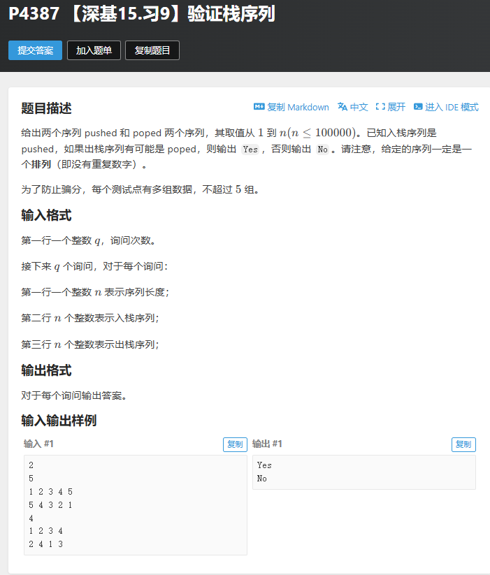

# 【算法题】P4387 验证栈序列
## 题目链接：https://www.luogu.com.cn/problem/P4387
## 题目截图
 

# 洛谷P4387【深基15.习9】验证栈序列 踩坑&解题总结

## 一、题目核心
验证给定的出栈序列是否可由指定入栈序列通过合法的栈操作得到，核心逻辑是**模拟栈的“边入边出”过程**：
1. 遍历入栈序列，逐个压入栈；
2. 每次压入后检查栈顶是否匹配出栈序列当前指针，匹配则弹出栈顶并后移指针；
3. 遍历结束后栈空 → 合法（Yes），否则不合法（No）。

## 二、核心踩坑点（WA/RE关键原因）

### 1. 静态数组越界（最致命）
- **错误写法**：用 `int a[1e5+10]` 存储多组数据的序列
- **问题本质**：多组数据的 n 之和可能超过数组大小，导致数据覆盖、读取错误
- **解决方案**：改用 `vector` 动态数组，每组数据单独创建 `vector<int> pushed(n)`

### 2. vector 使用不当
- 错误1：空 vector 直接下标赋值
- 错误2：范围 for 遍历整个静态数组（包含垃圾值）
- 正确做法：
  - 定义时指定大小：`vector<int> pushed(n);`
  - 空 vector 用 `push_back(x)`
  - 只用下标遍历前 n 个有效元素

### 3. 空栈访问 top()
- 错误：`while(b[head]==s.top())`
- 后果：栈空时访问栈顶 → 程序崩溃
- 正确：`while(!s.empty() && b[head]==s.top())`

### 4. 多余宏定义
- 错误：`#define int long long`
- 问题：内存翻倍、IO 变慢、易超时/超内存
- 正确：正常使用 `int`

## 三、机试实战要点

### 1. 容器选择原则
| 场景 | 推荐 | 原因 |
|------|------|------|
| 多组数据/动态长度 | vector | 动态分配，不越界 |
| 单组固定长度 | vector/数组 | vector 更安全 |
| 栈/队列 | stack/queue | 不用手写，少犯错 |

### 2. 效率优化
- 必须加 IO 加速
- 使用 `'\n'` 而不是 `endl`
- vector 提前开大小，避免频繁扩容

### 3. 边界必做
- 栈操作前必须判空 `!st.empty()`
- 下标访问不越界
- 多组数据在循环内新建容器，不互相污染

## 五、核心知识点巩固
1. 栈特性：**后进先出 LIFO**
2. 验证栈序列 = 模拟**边入边出**
3. `vector<int> a(n)` 表示开 n 个位置，可直接下标赋值
4. `!empty() && ...` 利用短路求值防止空栈访问

## 最终AC代码
```cpp
#include <bits/stdc++.h>
#define ios ios::sync_with_stdio(false), cin.tie(0), cout.tie(0);
using namespace std;
const int N=1e5;
int pushed[N],poped[N];

// P4387 【深基15.习9】验证栈序列
int main()
{
	ios;

	int q;
	cin >> q;
	
	while(q--){
		//处理每一次询问的输入 
		int n;
		cin>>n;
		
		vector<int> pushed(n);
		vector<int> poped(n);
		
		for(int j=0;j<n;j++){
			cin>>pushed[j];
		}
		for(int j=0;j<n;j++){
			cin>>poped[j];
		}
		
		stack<int> st;
		int pop_idx = 0;
		for(int x : pushed){
			st.push(x);		//  记录入栈序列
			while(!st.empty()&&poped[pop_idx]==st.top()){
			st.pop();
			pop_idx++;
			}
		}
		
		
		if(st.empty()){
			cout<<"Yes"<<'\n';
		}
		else{
			cout<<"No"<<'\n';
		}
	}

    return 0;
}
```
