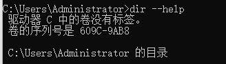

### What is the shell?
Computers these days have a variety of interfaces for giving them commands; fanciful graphical user interfaces, voice interfaces, and even AR/VR are everywhere. These are great for 80% of use-cases, but they are often fundamentally restricted in what they allow you to do — you cannot press a button that isn’t there or give a voice command that hasn’t been programmed. To take full advantage of the tools your computer provides, we have to go old-school and drop down to a textual interface: The Shell.

Nearly all platforms you can get your hands on have a shell in one form or another, and many of them have several shells for you to choose from. While they may vary in the details, at their core they are all roughly the same: they allow you to run programs, give them input, and inspect their output in a semi-structured way.

In this lecture, we will focus on the Bourne Again SHell, or “bash” for short. This is one of the most widely used shells, and its syntax is similar to what you will see in many other shells. To open a shell prompt (where you can type commands), you first need a terminal. Your device probably shipped with one installed, or you can install one fairly easily.

### Using the shell
When you launch your terminal, you will see a prompt that often looks a little like this:

```cpp
missing:~$
```

This is the main textual interface to the shell. It tells you that you are on the machine **missing** and that your “current working directory”, or where you currently are, is **~** (short for “home”). The [^$] tells you that you are not the root user (more on that later). At this prompt you can type a command, which will then be interpreted by the shell. The most basic command is to execute a program:

```cpp
missing:~$ date
Fri 10 Jan 2020 11:49:31 AM EST
missing:~$
```

Here, we executed the **date** program, which (perhaps unsurprisingly) prints the current date and time. The shell then asks us for another command to execute. We can also execute a command with arguments:

```
missing:~$ echo hello
hello
```


In this case, we told the shell to execute the program **echo** with the argument **hello**. The **echo** program simply prints out its arguments. The shell parses the command by splitting it by whitespace, and then runs the program indicated by the first word, supplying each subsequent word as an argument that the program can access. If you want to provide an argument that contains spaces or other special characters (e.g., a directory named “My Photos”), you can either quote the argument with **'** or **"** ("My Photos"), or escape just the relevant characters with \ (My\ Photos).

But how does the shell know how to find the **date** or **echo** programs? Well, the shell is a programming environment, just like Python or Ruby, and so it has variables, conditionals, loops, and functions (next lecture!). When you run commands in your shell, you are really writing a small bit of code that your shell interprets. If the shell is asked to execute a command that doesn’t match one of its programming keywords, it consults an environment variable called $PATH that lists which directories the shell should search for programs when it is given a command:

```
missing:~$ echo $PATH
/usr/local/sbin:/usr/local/bin:/usr/sbin:/usr/bin:/sbin:/bin
missing:~$ which echo
/bin/echo
missing:~$ /bin/echo $PATH
/usr/local/sbin:/usr/local/bin:/usr/sbin:/usr/bin:/sbin:/bin
```

When we run the **echo** command, the shell sees that it should execute the program **echo**, and then searches through the :-separated list of directories in **$PATH** for a file by that name. When it finds it, it runs it (assuming the file is executable; more on that later). We can find out which file is executed for a given program name using the which program. We can also bypass $PATH entirely by giving the path to the file we want to execute.

### Navigating in the shell

A path on the shell is a delimited list of directories; separated by / on Linux and macOS and \ on Windows. On Linux and macOS, the path / is the “root” of the file system, under which all directories and files lie, whereas on Windows there is one root for each disk partition (e.g., C:\). We will generally assume that you are using a Linux filesystem in this class. A path that starts with / is called an absolute path. Any other path is a relative path. Relative paths are relative to the current working directory, which we can see with the pwd command and change with the cd command. In a path, . refers to the current directory, and .. to its parent directory:

```cpp
missing:~$ pwd
/home/missing
missing:~$ cd /home
missing:/home$ pwd
/home
missing:/home$ cd ..
missing:/$ pwd
/
missing:/$ cd ./home
missing:/home$ pwd
/home
missing:/home$ cd missing
missing:~$ pwd
/home/missing
missing:~$ ../../bin/echo hello
hello
```
Notice that our shell prompt kept us informed about what our current working directory was. You can configure your prompt to show you all sorts of useful information, which we will cover in a later lecture.

In general, when we run a program, it will operate in the current directory unless we tell it otherwise. For example, it will usually search for files there, and create new files there if it needs to.

To see what lives in a given directory, we use the **ls** command:
```cpp
missing:~$ ls
missing:~$ cd ..
missing:/home$ ls
missing
missing:/home$ cd ..
missing:/$ ls
bin
boot
dev
etc
home
...
```

Unless a directory is given as its first argument, **ls** will print the contents of the current directory. Most commands accept flags and options (flags with values) that start with - to modify their behavior. Usually, running a program with the **-h** or **--help** flag will print some help text that tells you what flags and options are available. For example, **ls --help** tells us:


Some other handy programs to know about at this point are **mv** (to rename/move a file), **cp** (to copy a file), **rmdir**(to delete a existed directory), and **mkdir** (to make a new directory).

If you ever want more information about a program’s arguments, inputs, outputs, or how it works in general, give the **man** program a try. It takes as an argument the name of a program, and shows you its manual page. Press q to exit.
```cpp
missing:~$ man ls
```

### Connecting programs
In the shell, programs have two primary “streams” associated with them: their input stream and their output stream. When the program tries to read input, it reads from the input stream, and when it prints something, it prints to its output stream. Normally, a program’s input and output are both your terminal. That is, your keyboard as input and your screen as output. However, we can also rewire those streams!


